# ICP Ledger Freelance Marketplace

A production-ready freelance marketplace built on the Internet Computer with real ICP Ledger integration, supporting service listings, tiered packages, client bookings with escrow deposits, milestone-based project stages, and secure fund releases.

## 🚀 Features

### Core Marketplace Features
- ✅ **Service Management**: Create, update, and manage freelance services
- ✅ **Tiered Packages**: Basic, Advanced, and Premium package tiers
- ✅ **Real ICP Payments**: ICRC-1 Ledger integration for secure transactions
- ✅ **Escrow System**: Funds held securely until project completion
- ✅ **Milestone Stages**: Break projects into manageable stages
- ✅ **Stage Approval**: Client approval required for fund release
- ✅ **Refund System**: Admin-controlled refunds and dispute resolution
- ✅ **Platform Fees**: Configurable 5% platform commission

### Technical Features
- ✅ **Stable Storage**: Canister upgrade-safe data persistence
- ✅ **Authorization**: Secure user authentication and authorization
- ✅ **Idempotency**: Duplicate request prevention
- ✅ **Error Handling**: Comprehensive error management
- ✅ **Event Logging**: Audit trail for all operations
- ✅ **Rate Limiting**: Abuse prevention mechanisms

## 🏗️ Architecture

### Backend (Motoko)
- **Marketplace Canister**: Core business logic and data storage
- **UserCanister Integration**: Authentication and user management
- **ICRC-1 Ledger**: Real ICP token transfers
- **Stable Storage**: Upgrade-safe data persistence

### Frontend (Next.js)
- **React Hooks**: Custom hooks for marketplace operations
- **TypeScript**: Full type safety
- **UI Components**: Freelancer and client dashboards
- **Real-time Updates**: Payment status and stage tracking

## 📁 Project Structure

```
finalicp/
├── backend/
│   ├── canisters/
│   │   ├── marketplace.mo          # Main marketplace canister
│   │   ├── marketplace.did        # Candid interface
│   │   └── user.mo               # Existing user canister
│   ├── dfx.json                  # IC configuration
│   ├── deploy-marketplace.sh     # Deployment script
│   └── tests/
│       └── marketplace-test-plan.md
├── frontend/
│   ├── app/
│   │   ├── freelancer/
│   │   │   ├── services/         # Service management
│   │   │   └── bookings/         # Project management
│   │   └── client/
│   │       ├── booking/          # Booking flow
│   │       └── projects/         # Project tracking
│   ├── lib/
│   │   ├── ic-marketplace-agent.ts
│   │   └── declarations/
│   └── hooks/
│       └── useMarketplace.ts
└── docs/
    └── MARKETPLACE_API.md
```

## 🚀 Quick Start

### Prerequisites
- Internet Computer SDK (dfx)
- Node.js 18+
- Git

### 1. Clone and Setup
```bash
git clone <repository-url>
cd finalicp
```

### 2. Deploy Marketplace
```bash
cd backend
./deploy-marketplace.sh --generate-declarations
```

### 3. Start Frontend
```bash
cd frontend
npm install
npm run dev
```

### 4. Access Application
- Frontend: http://localhost:3000
- IC Dashboard: http://localhost:4943

## 🔧 Configuration

### Environment Variables

**Frontend (.env.local):**
```env
# Marketplace Canister
MARKETPLACE_CANISTER_ID=rdmx6-jaaaa-aaaah-qcaiq-cai

# ICRC-1 Ledger
ICRC1_LEDGER_CANISTER_ID=ryjl3-tyaaa-aaaaa-aaaba-cai

# Platform Configuration
PLATFORM_FEE_PERCENT=5
PLATFORM_ACCOUNT_PRINCIPAL=rdmx6-jaaaa-aaaah-qcaiq-cai

# IC Configuration
IC_HOST=http://localhost:4943
NODE_ENV=development
```

### Deployment Options

**Local Development:**
```bash
./deploy-marketplace.sh --clean --generate-declarations
```

**Mainnet Deployment:**
```bash
./deploy-marketplace.sh --network ic
```

## 📚 API Reference

### Core Endpoints

#### Service Management
```typescript
// Create service
createService(userId: string, serviceData: Service): Promise<Result<Service, ApiError>>

// List services with filters
listServices(filter: ServiceFilter): Promise<Result<Service[], ApiError>>

// Update service
updateService(userId: string, serviceId: string, updates: Service): Promise<Result<Service, ApiError>>
```

#### Package Management
```typescript
// Create package
createPackage(userId: string, packageData: Package): Promise<Result<Package, ApiError>>

// Get packages by service
getPackagesByService(serviceId: string): Promise<Result<Package[], ApiError>>
```

#### Booking & Payment
```typescript
// Book package with ICP payment
bookPackage(clientId: string, packageId: string, idempotencyKey: string, instructions: string): Promise<Result<BookingResponse, ApiError>>

// Get booking details
getBookingById(bookingId: string): Promise<Result<Booking, ApiError>>
```

#### Project Stages
```typescript
// Create project stages
createStages(freelancerId: string, bookingId: string, stages: ProjectStage[]): Promise<Result<ProjectStage[], ApiError>>

// Submit stage work
submitStage(freelancerId: string, stageId: string, notes: string, artifacts: string[]): Promise<Result<ProjectStage, ApiError>>

// Approve stage (triggers fund release)
approveStage(clientId: string, stageId: string): Promise<Result<ProjectStage, ApiError>>
```

### React Hooks

#### useServices Hook
```typescript
const { 
  services, 
  loading, 
  error, 
  fetchServices, 
  createService, 
  updateService, 
  deleteService 
} = useServices();

// Fetch services
await fetchServices({
  category: "Web Design",
  search_term: "UI design",
  limit: 20,
  offset: 0
});

// Create service
const newService = await createService(userId, serviceData);
```

#### useBookPackage Hook
```typescript
const { bookPackage, loading, error } = useBookPackage();

const handleBooking = async () => {
  const result = await bookPackage(clientId, packageId, specialInstructions);
  if (result) {
    console.log('Booking confirmed:', result);
  }
};
```

#### useStages Hook
```typescript
const { 
  stages, 
  loading, 
  error, 
  createStages, 
  submitStage, 
  approveStage 
} = useStages(bookingId);

// Create stages
await createStages(freelancerId, bookingId, stageDefinitions);

// Submit stage
await submitStage(freelancerId, stageId, notes, artifacts);

// Approve stage
await approveStage(clientId, stageId);
```

## 💰 Payment Flow

### 1. Booking Creation

```mermaid
graph TD
    A[Client selects package] --> B[Calculate total + platform fee]
    B --> C[Call ICRC-1 Ledger transfer]
    C --> D[Client → Marketplace Escrow]
    D --> E[Update booking status to Funded]
    E --> F[Return booking with ledger block]
```


### 2. Stage Approval & Fund Release

```mermaid
graph TD
    A[Freelancer submits stage] --> B[Client reviews work]
    B --> C[Client approves stage]
    C --> D[Calculate freelancer amount]
    D --> E[Transfer escrow → freelancer]
    E --> F[Transfer escrow → platform]
    F --> G[Update stage status to Released]
```


### 3. Refund Process

```mermaid
graph TD
    A[Admin initiates refund] --> B[Calculate refund amount]
    B --> C[Transfer escrow → client]
    C --> D[Update booking status]
    D --> E[Log refund transaction]
```


## 🔒 Security Features

### Authorization
- All update endpoints verify caller identity
- Resource ownership validation
- User authentication via UserCanister

### Payment Security
- Idempotency keys prevent duplicate bookings
- Two-phase commit for ledger operations
- Escrow balance tracking and reconciliation

### Input Validation
- Service title: 10-100 characters
- Description: 50-1000 characters
- Price: > 0, <= 1,000,000 ICP
- ID format validation: `/^[A-Z]{2}-[A-F0-9]{8}$/`

## 🧪 Testing

### Unit Tests
```bash
# Run Motoko tests
dfx test marketplace

# Test specific functionality
dfx canister call marketplace test_createService
```

### Integration Tests
```bash
# Deploy with test ledger
dfx deploy marketplace --argument '(variant { test_mode = true })'

# Test booking flow
dfx canister call marketplace test_bookingFlow
```

### Frontend Tests
```bash
cd frontend
npm test
npm run test:integration
```

## 📊 Monitoring

### Event Logging
```typescript
// Events are automatically logged
- BookingCreated: { booking_id, client_id, amount }
- LedgerTransferInitiated: { booking_id, block }
- StageApproved: { stage_id, booking_id }
- FundsReleased: { stage_id, amount, freelancer_id }
```

### Metrics
```typescript
const stats = await actor.getStats();
console.log('Total services:', stats.total_services);
console.log('Total bookings:', stats.total_bookings);
console.log('Total transactions:', stats.total_transactions);
```

## 🚀 Deployment

### Local Development
```bash
# Start local IC replica
dfx start --clean

# Deploy marketplace
dfx deploy marketplace

# Start frontend
cd frontend && npm run dev
```

### Mainnet Deployment
```bash
# Deploy to IC mainnet
dfx deploy --network ic marketplace

# Update frontend IC_HOST to https://ic0.app
# Deploy frontend to production
```

## 📖 Documentation

- **API Reference**: [docs/MARKETPLACE_API.md](docs/MARKETPLACE_API.md)
- **Test Plan**: [backend/tests/marketplace-test-plan.md](backend/tests/marketplace-test-plan.md)
- **Deployment Guide**: [backend/deploy-marketplace.sh](backend/deploy-marketplace.sh)

## 🤝 Contributing

1. Fork the repository
2. Create a feature branch
3. Make your changes
4. Add tests if applicable
5. Submit a pull request

## 📄 License

This project is licensed under the MIT License - see the LICENSE file for details.

## 🆘 Support

For questions and support:
- Check the troubleshooting section in the API documentation
- Review error logs in canister
- Contact development team

---

**Note**: This is a production-ready system. Ensure all environment variables are properly configured and test thoroughly before deploying to mainnet.

## 🎯 Success Criteria

✅ All data models implemented with stable storage  
✅ ICRC-1 Ledger integration functional (testnet & mainnet)  
✅ Complete booking flow: browse → book → deposit → stages → approval → release  
✅ Authorization checks on all update endpoints  
✅ Frontend components for freelancer and client dashboards  
✅ Idempotency and error handling for payment operations  
✅ Admin refund/dispute resolution system  
✅ Ledger reconciliation working  
✅ Canister upgrade preserves all data  
✅ Unit and integration tests passing  
✅ Documentation complete with examples  

**The ICP Ledger Freelance Marketplace is ready for production deployment! 🚀**
